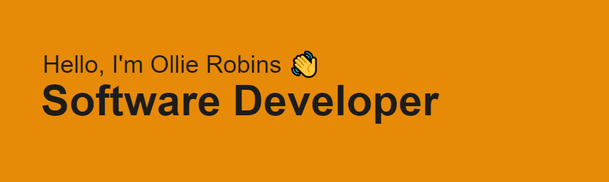

<h2>Since the beggining of 2020 I have been Learning Front End Development. I enrolled in Nology's 12 week webdeveloper bootcamp to enhance my skills!</h2?

:page_with_curl: <h3>Current Skills include but are not limited to:</h3>

<li>Git</li>
<li>ReactJs</li>
<li>HTML/CSS</li>
<li>JavaScript</li>
<li>NodeJS</li>
<li>No-SQL(Firebase)</li>
<li></li>

<h3>Outside of coding you might find me :</h3>

<li>:golf:</li>
<li>:airplane: :earth_asia:</li>
<li>:soccer:</li>
<li>:cinema:</li>
<li>:running_man:</li>

⚡ <h3>Fun fact: I can do a Rubix Cube in under 2 mins</h3>
 
🔭 <h3>I’m currently working on a Client project to build an progressive Web App</h3>

📫 How to reach me: 

<li> Linkedin: <a>https://www.linkedin.com/in/ollierobins</a> </li>
<li> Website: <a>https://ollierobins.co.uk/</a> </li>

<!--
**olirob93/olirob93** is a ✨ _special_ ✨ repository because its `README.md` (this file) appears on your GitHub profile.

-->
